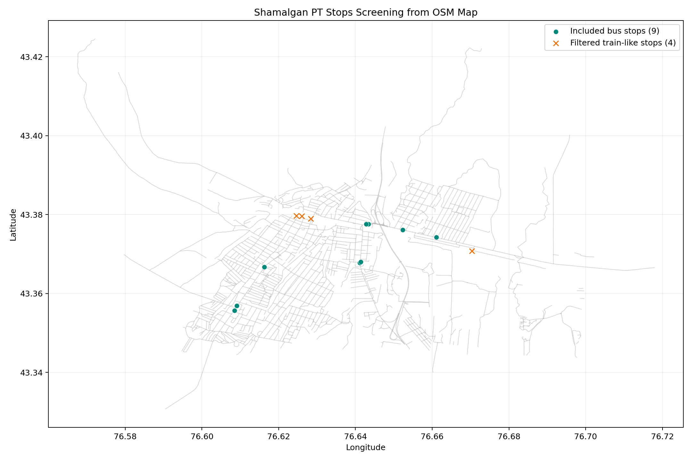
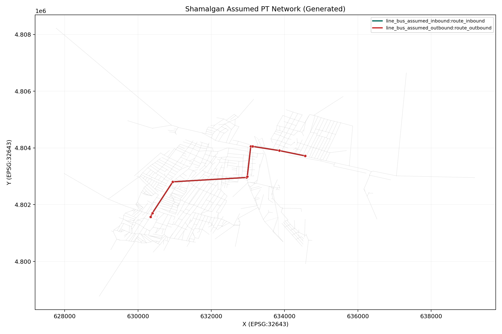
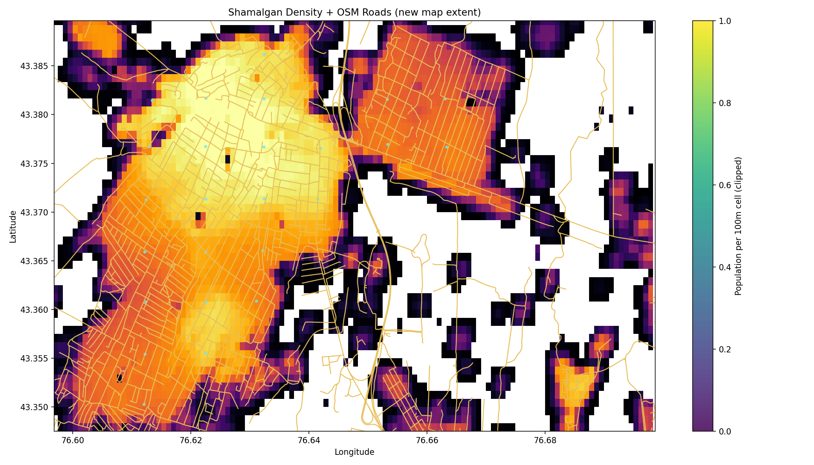

# MATSim Shamalgan Scenario

Transport simulation model for **Shamalgan (Zhibek Zholy), Kazakhstan** using MATSim.

This repository currently includes:
- Road network built from OSM (`scenarios/shamalgan/network.xml`)
- Synthetic population from derived zones (`scenarios/shamalgan/population.xml`)
- PT bootstrap from mapped bus stops (`scenarios/shamalgan/transitSchedule.xml`, `scenarios/shamalgan/transitVehicles.xml`)
- PT-enabled network (`scenarios/shamalgan/network-with-pt.xml`)
- Analysis artifacts and helper scripts (`analysis-artifacts/`, `tools/`)

## What We Are Doing

The project goal is to build a reproducible Shamalgan baseline scenario and progressively replace assumptions with real observed data.

Current PT status:
- No reliable full GTFS yet for Almaty/Shamalgan corridor.
- PT schedule is assumption-based from mapped stops.
- Assumptions used in current PT build:
  - Bus speed: `30 km/h`
  - Dwell time: `60 s`
  - Headway: `360 s` (6 minutes)
  - Service window: `06:00` to `23:00`

## Quick Start

Compile:

```powershell
.\mvnw.cmd -q -DskipTests compile
```

Run default Shamalgan scenario:

```powershell
.\mvnw.cmd -q exec:java "-Dexec.mainClass=org.matsim.project.RunShamalgan"
```

Run PT-enabled scenario with SimWrapper dashboards:

```powershell
.\mvnw.cmd -q exec:java "-Dexec.mainClass=org.matsim.project.RunShamalgan" "-Dexec.args=scenarios/shamalgan/config-pt.xml --simwrapper"
```

Build assumed PT inputs from mapped OSM bus stops:

```powershell
.\mvnw.cmd -q exec:java "-Dexec.mainClass=org.matsim.project.PrepareShamalganTransitFromAssumptions" "-Dexec.args=scenarios/shamalgan/network.xml analysis-artifacts/pt-data/osm_bus_stops.csv scenarios/shamalgan/network-with-pt.xml scenarios/shamalgan/transitSchedule.xml scenarios/shamalgan/transitVehicles.xml 30 60 360 06:00:00 23:00:00"
```

Archive old outputs (keeps newest):

```powershell
powershell -ExecutionPolicy Bypass -File tools\archive_outputs.ps1 -KeepLatest 1
```

## Visuals

OSM bus stops used for PT bootstrap:



Assumed PT network map:



Zone-based population derivation (example):



## Repository Structure

- `scenarios/shamalgan/`: runnable scenario inputs and configs
- `original-input-data/shamalgan/`: raw source data (OSM, raster, templates)
- `src/main/java/org/matsim/project/`: Shamalgan preparation and run classes
- `tools/`: utility scripts for extraction, QC, plotting, housekeeping
- `analysis-artifacts/`: generated diagnostics, plots, and PT reference notes

## Data and Licensing

- Code license: see `LICENSE`.
- Input data in `original-input-data/` may have source-specific licenses and must be verified before redistribution.
